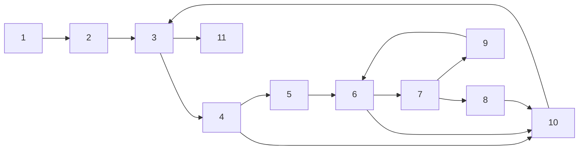

# Quiz 7.3


## Q1
---

- a
    ```mermaid
    graph LR
    A((n1: w=x))
    B((n2: w++))
    C((n3: w=2*w))
    D((n4: 無))
    E((n5: x=5*y))
    F((n6: x=3*y+5))
    G((n7: z=w+x))

    A -->|m > 0| B
    A -->|m <= 0| C
    B --> D
    C --> D
    D -->|y <= 10| E
    D -->|y > 10| F
    E --> G
    F --> G
    ```
    ```
    def(1)=def(2)=def(3)=use(2)=use(3)=use(7)
    ```
    
- b: 節點有 w的定義: w為左值(出現在等號左側)時，為 n1、n2、n3
- c: 節點有 w的使用: w為右值(出現在等號右側)時，為 n2、n3、n7
- d: 沒有 du(1,7,w)，因為從 1 到 7 之間過程一定會經過 2 或 3 被重複定義。
- e
    - w 所有定義使用路徑: def(1)=def(2)=def(3)=use(2)=use(3)=use(7) = {w}
        - du(1,2,w): [(1,2)]
        - du(1,3,w): [(1,3)]
        - du(1,7,w): []
        - du(2,2,w): []
        - du(2,3,w): []
        - du(2,7,w): [(2,4,5,7),(2,4,6,7)]
        - du(3,2,w): []
        - du(3,3,w): []
        - du(3,7,w): [(3,4,5,7),(3,4,6,7)]
    - x 所有定義使用路徑: def(1)=def(5)=def(6)=use(1)=use(7) = {x}
        - du(1,1,x): []
        - du(1,7,x): []
        - du(5,1,x): []
        - du(5,7,x): [(5,7)]
        - du(6,1,x): []
        - du(6,7,x): [(6,7)]

<br>


## Q4 針對 iSub 變數
---


```
def(2)=def(10)=use(9)=use(10)=use(11) = {iSub}
```

解答思路

- 已給的測試用例
    ```
    t1: [1,2,3,4,5,6,7,9,6,10,3,11]
    t2: [1,2,3,4,5,6,10,3,11]
    t3: [1,2,3,4,5,6,7,8,10,3,11]
    t4: [1,2,3,4,10,3,4,10,3,11]
    t5: [1,2,3,11]
    t6: [1,2,3,4,10,3,4,5,6,7,9,6,10,3,11]
    t7: [1,2,3,4,10,3,4,5,6,10,3,11]
    t8: [1,2,3,4,10,3,4,5,6,7,8,10,3,11]
    ```
    
- 已給的定義使用路徑。
    ```
    p1: [2,3,4,5,6,7,9]
    p2: [2,3,4,5,6,10]
    p3: [2,3,4,5,6,7,8,10]
    p4: [2,3,4,10]
    p5: [2,3,11]
    p6: [10,3,4,5,6,7,9]
    p7: [10,3,4,5,6,10]
    p8: [10,3,4,5,6,7,8,10]
    p9: [10,3,4,10]
    p10:[10,3,11]
    ```

- 遊歷狀況
    |     | direct                                     | w/ sidetrip                 |
    | --- | ------------------------------------------ | --------------------------- |
    | t1  | (2,3,4,5,6,7,9), (10,3,11)                 |                             |
    | t2  | (2,3,4,5,6,10), (10,3,11)                  |                             |
    | t3  | (2,3,4,5,6,7,8,10), (10,3,11)              | (2,3,4,5,6,10)              |
    | t4  | (2,3,4,10), (10,3,4,10), (10,3,11)         |                             |
    | t5  | (2,3,11)                                   |                             |
    | t6  | (2,3,4,10), (10,3,4,5,6,7,9), (10,3,11)    | (10,3,4,5,6,10),(10,3,4,10) |
    | t7  | (2,3,4,10), (10,3,4,5,6,10), (10,3,11)     | (10,3,4,10)                 |
    | t8  | (2,3,4,10), (10,3,4,5,6,7,8,10), (10,3,11) | (10,3,4,5,6,10),(10,3,4,10) |


解答 :

- a: 使用已給的測試用例，找出全定義覆蓋的最小測試案例集
    - ans: 從 {t1,t2,t3,t4,t6,t7,t8} 中任取一，都滿足def(2)、def(10)被至少使用一次。

- b: 找出滿足全使用覆蓋的最小測試案例集
    - ans: 可以為 {t1,t4,t5,t6} 或 {t1,t5,t6,t7}，滿足所有定義使用配對使用一次。

- c: 找出滿足全定義使用路徑覆蓋的最小測試案例集
    - ans: 唯一一組 {t1,t2,t3,t4,t5,t6,t7,t8}

<br>


## Q5
---

- a: 

    inputs: [subject, pattern, output]
    - i0: ("brown owl", "wl", 7),
    - i1: ("brown fox", "dog", -1)
    - i2: ("fox", "brown", -1)
    
    | inputs | tour path                                                                 |
    |--------|---------------------------------------------------------------------------|
    | i0     | [1,2,(3,4,10)**3,(3,4,5),(6,7,8,10),(3,4,10)**3,(3,4,5),(6,7,9),(6,10,3,11)] |
    | i1     | [1,2,(3,4,10)**7,3,11]                                                    |
    | i2     | [1,2,3,11]                                                                |
    
    解釋路徑意義:
    - (3,4,10) 比對 subject 與 pattern 首字，不匹配
    - (3,4,5)  比對 subject 與 pattern 首字，匹配成功
    - (6,7,8,10)  首字成功後繼續匹配，用pattern 下一個文字進行匹配，不匹配
    - (6,7,9)  首字成功後繼續匹配，用pattern 下一個文字進行匹配，匹配
    - (6,10,3,11) 剩餘的文字長度不夠時結束比對。

- b: 

    我們忽略作為其他 du 路徑，前綴的 du 路徑，得到以下路徑。
    ```
    du(10,iSub) [10, 3, 4, 5, 6, 7, 9],
                [10, 3, 4, 5, 6, 10],
                [10, 3, 4, 5, 6, 7, 8, 10],
                [10, 3, 4, 10],
                [10, 3, 11], 
    du(2,isPat) [2, 3, 4] 、[2, 3, 11] 
    du(5,isPat) [5, 6, 10, 3, 4]、[5, 6, 10, 3, 11] 
    du(8,isPat) [8, 10, 3, 4]、[8, 10, 3, 11] 
    ```

    考慮直接遊歷的定義使用路徑為:
    - i0: 
        - direct: [(10,3,4,5,6,7,9),(10,3,4,5,6,7,8,10),(10,3,4,10),(10,3,11),(2,3,4),(8,10,3,4)]
        - sidetrip: [(10,3,4,5,6,10),(5,6,10,3,11)]
    - i1: 
        - direct: [(10,3,4,10),(10,3,11),(2,3,4)]
        - sidetrip: [(2,3,11)] 
    - i2: 
        - direct: [(2,3,11)]


- c: 因為路徑順序為 (5, 6, 10, 3) 時，代表剩餘的文字長度不夠無法繼續執行，接下來一定是 11，所以 4 是不可能到達的。

- d: 
    - 未覆蓋的定義使用路徑: [(10,3,4,5,6,10),(5,6,10,3,11),(8,10,3,11)]
    - (ab,b,1): (10,3,4,5,6,10)
    - (ab,a,0): (5,6,10,3,11)
    - (ab,ac,-1): (8,10,3,11)

- e: isPat全定義覆蓋的最小測試集
    - 可為 {i0, (ab,a,0)}
        - 因為 [5,6,10,3,4] 必無測試用例。故僅須滿足剩餘的5個路徑。
        ```
        [2, 3, 4] 、[2, 3, 11]、[5, 6, 10, 3, 11]、[8, 10, 3, 4]、[8, 10, 3, 11] 
        ```
        - 由於，i0 已滿足 def(2)、def(8)，再取 (ab,a,0) 滿足 def(5) 形成測試集。

- f: isPat全使用覆蓋的最小測試集
    - 承 e 對 isPat 的路徑說明
    - 可為 {i0, i2, (ab, a), (ab, ac)} 
        - i0: 滿足 du(2,4)、du(8,4)     
        - i2: 滿足 du(2,11)
        - (ab, a): 滿足 du(5,11)
        - (ab,ac,-1): 滿足 du(8,11)

- g: 對於 pat()方法中的變量 isPat，All-Uses Coverage 和 all-DU-Paths Coverage 之間有什麼區別嗎？
    - 看不懂這裡的pat()方法是什麼???

<br>